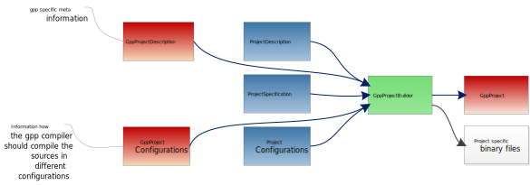

G++ Project Compilation
=======================

Creating your software project with the g++ means to setup a build process that handles the coordination of compiling single source files
and linking the create object files together with perhaps other premade libraries or binary code from other projects.

Rokuby provides a way to do this in a similar fashion to [creating visual studio projects](file.visual_studio.html) (here visual studio handles the coordination for
the compilation and linking process). Because we want to make this build process similar to the visual studio process we have similar and even some shared
logical constructs.

G++ Project Creation
------------------------------

First let us see the project creation workflow.

Remember the simple project workflow, which is described on [Projects](file.projects.html) :

You can see that the g++ workflow is almost the same as the visual studio workflow with almost the same additional information units and the same output
information unit, namely a GppProject. In what they differ is that the GppProjectBuilder directly creates the binary output that results from the
compilation and link steps in a project.

Reference
-----------------

As the build process here is pretty self explanatore once you have read [Basic Project Creation](file.projects.html) and
[Visual Studio Solution Creation](file.visual_studio.html), I will only state the source files that are used in this process.

Information Units:

- [GppProjectDescription Source](Rokuby/GppProjectDescription.html)
- [GppProjectConfiguration Source](Rokuby/GppProjectConfiguration.html)
- [GppProject Source](Rokuby/GppProject.html)

Processors:

- [GppProjectBuilder Source](Rokuby/GppProjectBuilder.html)