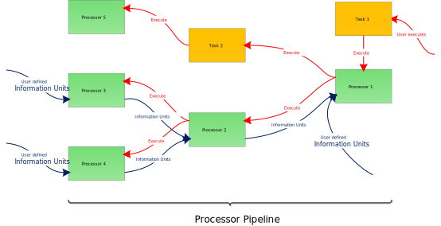

Information Units & Processors
==============================

There are two very important classes in Rokuby:

- Information Units: They represent the basic unit of information in Rokuby that can be passed around between different processors.
- Processors: They process information units to achieve certain goals.

As mentioned in the [Introduction](file.introduction.html) processors are Rake tasks that share all the functionality that of these tasks.
They can depend on tasks or be a dependency for other tasks. And they can also be executed.

But they are also much more than tasks. In addition to their task behaviour they can pass information to processors that are further up
the task chain. This means that if a processor depends on another processor it automatically receives the created output information
unit of the processor on which it depends.

A basic processor workflow is given below:

We will now dive a little bit deeper into the basic features of these two important classes.

Information Units
-----------------

The basic information unit class exhibits only one feature. It establishes a generic interface to create a information unit.
This is done via the Extend method. Normally, this method will not be visible to the user of the Rokuby DSL. But it is a good way to understand
how the creation of an information unit works.

Before we further look at the Extend method of the information unit class we will discuss a property that all information units should share.

    Information units are simple data containers whose properties follow a simple set/get paradigm and which are copyable without problems.
    
This property makes it easy to pass information units around and propagate them in between the differen processors.

In this manner, the Extend method is a simple mean of setting multiple properties of an information unit at once. See the [InformationUnit class](Rokuby/InformationUnit.html)
for further documentation. One important thing about the Extend method is that array and map type attributes in the information unti will be extended with
the additional values given in the extend method (therefore the name extend). This means that inputting an attribute value of `[3, 4]` to an information unit
that already contains values `[1, 2]` in this attribute results in an attribute of the information unit being `[1, 2, 3, 4]`.

This makes the definition of an information unit very easy:

    infoUnit InformationUnitClass, "IUName", {
        attribute1: value1,
        attribute2: value2,
        attribute3: value3
    }

which is a short form for

    infoUnit(InformationUnitClass, "IUName", {
        attribute1: value1,
        attribute2: value2,
        attribute3: value3
    })
    
Normally, there are functions that are specific for the creation of certain information units. For example:

    projDescr "ProjectDescriptionName", {
        name: "ProjectName",
        version: "1.0"
    }
    
The functions that are available to create certain information untis (and also processors) are members of the `Rokuby::DSL` namespace.

The nice thing is that once the information units are defined you can easily obtain them via their name. For example

    projDescr "ProjectDescriptionName"
    
will return you the instance of the project description information unit defined above.

Processors
----------

The processors of Rokuby are more complex than the simple information units. Therefore, their definition is also a little bit more bothersome.
To undertand their creation, we should look at their similarity and differences in comparison to information units.

First processors can also have attributes and they can be set in a similar fashion as the information unit attributes by defining a Hash that
contains the names and values of the attributes. The extend method of processor bears the same logical behaviour as the information unit
extend method.

But what is even more important when defining a processor is to input the correct information untis that should be processed by the processor.
This can simply be done by inputting an array of the information units you deem necessary for the processor.

    defineProc ProcessorClass, "ProcessorName", :procIns, :procArgs, :procDeps