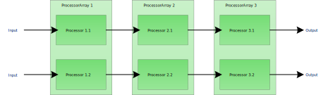

Multi-Platform Project Build Processes
======================================

So far you should have read about:

- [General Project Build Processes](file.projects.html)
- [Visual Studio Solution Builder](file.visual_studio.html)
- [G++ Project Builder](file.gpp.html)

Now we come to the more interesting part of how to combine these components into a multi-platform build process.

And guess what: it is rather easy!

Processor Arrays for simple parallel Process Creation
-----------------------------------------------------

First let me explain a basic principle that is applied here to generate two more or less parallel and similar processes.
As already explained the workflows or rather the order and type of processors used to build projects and chains of projects
with G++ and visual studio are almost the same.

Therefore, we will apply a simple pattern to allow for easy creation of such parallel processes, namely ProcessorArrays.
These arrays are processors but at the same time they save references to multiple other processors. In this way, you can create
multiple parallel chains of processors at the same time. This saves time, and effort, and code duplication when creating build
process chains for multiple platforms.

Let us see this in a graphic:

As you can see the processors in the array are connected to each other. When executing the last processor of one of these two chains
all the previous processors in this single chain will be executed.

Remeber that the processor array does nothing else than to provide an easy paradigm and interface to put together multiple process
chains at the same time.

Let us see this in code:

    projDescr :MultiPlatformApp, {}
    projSpec :MultiPlatformApp, {}
    vsProjDescr :MultiPlatformApp, {}
    gppProjDescr :MultiPlatformApp, {}
    
    projConfigs = defaultProjectConfigurations() 
    vsProjConfigs = defaultVsProjectConfigurations()
    gppProjConfigs = defaultGppProjectConfigurations()
    
    multiProjBuild :MultiPlatformApp, :ins => [projDescr(:MultiPlatformApp), projSpec(:MultiPlatformApp), vsProjDescr(:MultiPlatformApp), gppProjDescr(:MultiPlatformApp)]
                                        + projConfigs + vsProjConfigs + gppProjConfigs,
                                        :procTypes => [:Vs, :Gpp]
                                        
As you can see you only need one command to create an array of processors for multiple platforms (assumed the information units are already defined).
This command generates a so called MultiProjectBuilder which is an array of project builders with the stated processor types (procTypes).

To chain multiple of these projects, you just do the following:

    multiProjBuild :MultiPlatformStaticLib, ...
    multiProjBuild :MultiPlatformSharedLib, ...
    
    chain :MultiPlatformChain, :MultiPlatformStaticLib, :MultiPlatformApp
    chain :MultiPlatformChain, :MultiPlatformSharedLib, :MultiPlatformApp
    
This will make the application dependend on two libraries a static and shared one whose build processes are setup in the previous calls. Remember that you
do not need to connect the processors explicitely as they are automatically connected through their processor type (the procTypes symbols). You are also
spared from inputing the correct information units into each processors separately as they automatically drop unknown input information units.

When dealing with visual studio solutions you also want to create such a solution.

    multiSlnBuild :MultiPlatformSln, :ins => [..], :procTypes => [:Vs]
    
    chain :MultiPlatformChain, :MultiPlatformApp, :MultiPlatformSln
    chain :MultiPlatformChain, :MultiPlatformSharedLib, :MultiPlatformSln
    chain :MultiPlatformChain, :MultiPlatformStaticLib, :MultiPlatformSln
    
This will create the correct dependencies between the solution builder for visual studio and the corresponding project builders.

Finally, there is only one thing left, namely starting up such multi-platform chain. To start such a chain you start with the last processor in the
corresponding single platform chain.

    desc "Start G++ build chain"
	gppProjBuild multiProjBuild(:MultiPlatformApp).ArrayProcessors[:Gpp].Name()
    