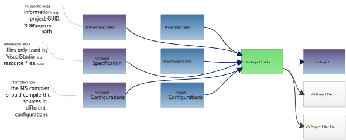

Visual Studio Solution Builder
==============================

Rokuby features a set of processors and information units that are meant to create VisualStudio projects and solutions.
In Visual Studio a IDE representation of your software project is called a *Solution*. Each Solution can be made up of several
*Project*s. They represent binaries that are build in the course of creating your software project.

For example, given we want to build an application and decided that we want to extract some of the code into a separate library.
We would create two projects one for the library code and one for the application code, which are compiled and linked separately.
Then we would put these two projects into one final solution which encapsulates them in a single IDE environment.

Visual Studio Project Creation
------------------------------

First let us see the project creation workflow.

Remember the simple project workflow, which is described on [Projects](file.projects.html) :

As you can see they are different in a few things but are the same in other things. Both processes include one project builder processor
which creates the information needed to pass the project around as a information unit. The project builders also share some of the input
information unit that desribe the project. This includes general project description, specification and configurations.

The difference between the two on the one hand the additional input for the visual studio project build and the result that is available after
executing the process builder.

The input is extended by some information units that include visual studio specific parts of project description, specification and configurations.
When looking at the output of the porject builder, we see a visual studio specific version of the project information unit. Additionally, the project
builder will create files that represent the project setup.

Visual Studio Solution Creation
-------------------------------

The solution build process is rather simple:

You can see that the visual studio project information units are presented as input to the solution builder. In the end the solution builder will
have created a solution file that includes the information about the solution and also an information unit with some of the information about the
solution.

Example
-------

Let us see a visual studio solution which is made up of several projects. A main application is dependend on two libraries from which one is
a static library and another one is a dynamic library. In the following some of the visual studio specific code is shown, we have left out some of
the basic declarations (e.g. source specifications) for simplicity.

    projDescr "MainApplication", {
        name: "MainApplication",
        binaryName: "myApplication",
        binaryType: :Application
    }
    
    vsProjSpec "MainApplication", {
        resSpec: fileSpec("MainApplicationResources")
    }
    
    projDescr "StaticLibrary", {
        name: "StaticLibrary",
        binaryName: "myStaticLibrary",
        binaryType: :Static
    }
    
    projDescr "SharedLibrary", {
        name: "SharedLibrary",
        binaryName: "mySharedLibrary",
        binaryType: :Shared
    }
    
    vsProjBuild "MainApplicationBuild", :ins => [projDescr("MainApplication"), projSpec("MainApplication"), vsProjSpec("MainApplication")]
                                                + defaultProjectConfigurations() + defaultVsProjectConfigurations()
    vsProjBuild "StaticLibraryBuild", :ins => [projDescr("StaticLibrary"), projSpec("StaticLibrary")]
                                                + defaultProjectConfigurations() + defaultVsProjectConfigurations()
    vsProjBuild "SharedLibraryBuild", :ins => [projDescr("SharedLibrary"), projSpec("SharedLibrary")]
                                                + defaultProjectConfigurations() + defaultVsProjectConfigurations()
    
As you can see the main application additionally contains some resource files that are specified in a VsProjectSpecification. The two libraries only contain standard
source code. The one thing that is important here are the VsProjectConfigurations. In the optimal case you can put in the same VsProjectConfigurations to all project builds.
You do not necessarily have to use the default configurations that are already prepared by Rokuby. You can clone and alter them or create your own configurations. What you
should pay attention to is that the complete solution can only build in a configuration if the PlatformConfiguration of this configuration is available in all other projects.
Therefore, pay attention to provide a matching set of configurations to all projects.

Now let us combine the projects into a solution which can simply be done by doing:

    vsSlnDescr "MySolution", :name => "MySolution"
    
    vsSlnBuild "MyVsSolutionBuild", :ins => [vsSlnDescr("MySolution")]
    
    chain :SlnChain
    chain :SlnChain, "MainApplicationBuild", "MyVsSolutionBuild"
    chain :SlnChain, "StaticLibraryBuild", "MyVsSolutionBuild"
    chain :SlnChain, "SharedLibraryBuild", "MyVsSolutionBuild"
    
So now we have put in the main application project and the two libraries project into the solution builder. This means the project will appear in the
visual studio solution and can be build from there. It works by chaining the solution builder processors to the solution builder processor. The output
projects of the project builders are now an input to the solution builder which will interpret received projects as a command to put them into the
solution.

The projects are now in the solution but they still do not depend on each other as described above. Visual studio comes with a premade dependency
management which is imitated by Rokuby. You can simply chain the project builders in the following manner:

    chain :SlnChain, "StaticLibraryBuild", "MainApplicationBuild"
    chain :SlnChain, "SharedLibraryBuild", "MainApplicationBuild"
    
This will input the projects of the static and shared library into the project builder for the main application. The project builder of the main application
in turn will interpret these projects as subprojects on which itself depends. This information will be integrated into the final solution which means that
by building the main application we automatically check for necessary rebuilds of the subprojects (if this is enabled in visual studio).

We have now build a visual studio solution with several projects that are dependend on each other. By executing the task/processor `MyVsSolutionBuild` we can now
create a fully functional visual studio solution.

More on Visual Studio Project Dependencies -  The VsProjectUsage class
----------------------------------------------------------------------

Chaining the process in the manner above is fine and will put the projects into a corresponding dependency in the visual studio project.
But this is not enough to fully control the possibilities that visual studio provides to handle project dependencies. There are further ways
in which visual studio allows you to control this behaviour.
To propagate these possibilities the VsProjectUsage class was created that holds exactly the information necessary to control this behaviour.
If you want to deviate from the standard behaviour that visual studio provides you can do it like in the following example. Assume the example above
in which we have now to add some additional elements:

    vsProjDescr "StaticLibrary", guid: "{34aaa03b-5dd7-4228-9845-db359b137cb6}"
    vsProjUsage "StaticLibrary", {
        :Guid => Clone(vsProjDescr("StaticLibrary").Guid),
	:UseLibraryDependencyInputs => true
    }
    
    vsProjBuild "StaticLibraryBuild", :ins => [vsProjDescr("StaticLibrary")]
    
    vsProjBuild "MainApplicationBuild", :ins => [vsProjUsage("StaticLibrary")]
    
What we did in this code snippet is:

- Create and input a VsProjectDescription that gives the static library project a known guid.
- Create a VsProjectUsage object that obtains the guid of the project on which our application depends.
- Input the project usage object into the application builder to inform him how this specific subproject
  should be handled.
  
Reference
---------

Here are references to the classes presented in this chapter.

Information Units:

- [VsProjectDescription Source](Rokuby/VsProjectDescription.html)
- [VsProjectSpecification Source](Rokuby/VsProjectSpecification.html)
- [VsProjectConfiguration Source](Rokuby/VsProjectConfiguration.html)
- [VsProjectUsage Source](Rokuby/VsProjectUsage.html)
- [VsProject Source](Rokuby/VsProject.html)

Processors:

- [VsProjectBuilder Source](Rokuby/VsProjectBuilder.html)
- [VsSolutionBuilder Source](Rokuby/VsSolutionBuilder.html)
